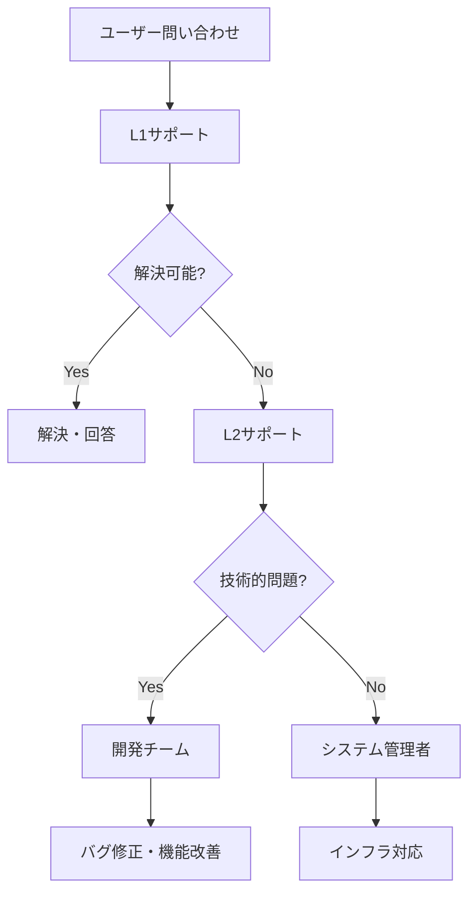
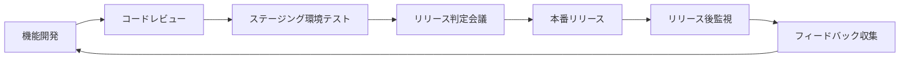

# フェーズ 5: 運用・保守設計書

**期間**: 9/24–継続  
**マイルストーン**: 安定運用・継続改善

---

## 1. 目標

- 本番環境での安定運用確立
- ユーザーサポート体制構築
- 継続的な機能改善プロセス確立
- システム監視・保守体制確立
- データ分析による運用最適化
- 長期的な技術負債管理

---

## 2. 運用体制

### 2.1 運用チーム構成

| 役割 | 責任者 | 業務内容 | 対応時間 |
|------|--------|----------|----------|
| システム管理者 | DevOpsエンジニア | インフラ監視、障害対応 | 24時間365日 |
| アプリケーション管理者 | リードエンジニア | アプリ監視、バグ修正 | 平日9-18時 |
| ユーザーサポート | カスタマーサポート | ユーザー問い合わせ対応 | 平日9-17時 |
| データ分析者 | データアナリスト | 利用状況分析、改善提案 | 平日9-18時 |

### 2.2 エスカレーション体制



---

## 3. 監視・アラート体制

### 3.1 システム監視設定

#### 3.1.1 Firebase監視設定

```typescript
// functions/src/monitoring/healthCheck.ts
import { https } from 'firebase-functions';
import { firestore } from '../lib/firebase-admin';

export const healthCheck = https.onRequest(async (req, res) => {
  const healthStatus = {
    timestamp: new Date().toISOString(),
    status: 'healthy',
    services: {
      firestore: 'unknown',
      auth: 'unknown',
      functions: 'healthy',
    },
    metrics: {
      responseTime: 0,
      activeUsers: 0,
      dailyAttendance: 0,
    },
  };

  const startTime = Date.now();

  try {
    // Firestore接続確認
    await firestore.collection('health').doc('check').get();
    healthStatus.services.firestore = 'healthy';

    // メトリクス取得
    const today = new Date().toISOString().split('T')[0];
    const attendanceSnapshot = await firestore
      .collection('attendance')
      .where('date', '==', today)
      .get();
    
    healthStatus.metrics.dailyAttendance = attendanceSnapshot.size;
    healthStatus.metrics.responseTime = Date.now() - startTime;

  } catch (error) {
    console.error('Health check failed:', error);
    healthStatus.status = 'unhealthy';
    healthStatus.services.firestore = 'unhealthy';
  }

  res.status(healthStatus.status === 'healthy' ? 200 : 503).json(healthStatus);
});

// メトリクス収集
export const collectMetrics = https.onRequest(async (req, res) => {
  try {
    const metrics = await gatherSystemMetrics();
    
    // Cloud Monitoringにメトリクスを送信
    await recordCustomMetrics(metrics);
    
    res.json(metrics);
  } catch (error) {
    console.error('Metrics collection failed:', error);
    res.status(500).json({ error: 'Metrics collection failed' });
  }
});

async function gatherSystemMetrics() {
  const now = new Date();
  const oneHourAgo = new Date(now.getTime() - 60 * 60 * 1000);

  // アクティブユーザー数
  const activeUsersSnapshot = await firestore
    .collection('attendance')
    .where('clockInTime', '>=', oneHourAgo.toISOString())
    .get();

  // エラー率
  const errorsSnapshot = await firestore
    .collection('errorLogs')
    .where('timestamp', '>=', oneHourAgo.toISOString())
    .get();

  // レスポンス時間の計測
  const responseTimeStart = Date.now();
  await firestore.collection('users').limit(1).get();
  const responseTime = Date.now() - responseTimeStart;

  return {
    activeUsers: activeUsersSnapshot.size,
    errorCount: errorsSnapshot.size,
    responseTime,
    timestamp: now.toISOString(),
  };
}
```

#### 3.1.2 アラート設定

```yaml
# monitoring/alerts.yaml
alertPolicy:
  displayName: "勤怠アプリ アラート"
  conditions:
    - displayName: "エラー率高騰"
      conditionThreshold:
        filter: 'resource.type="cloud_function"'
        comparison: COMPARISON_GT
        thresholdValue: 5 # 5%以上
        duration: "300s"
      
    - displayName: "レスポンス時間悪化"
      conditionThreshold:
        filter: 'resource.type="cloud_function"'
        comparison: COMPARISON_GT
        thresholdValue: 5000 # 5秒以上
        duration: "300s"
    
    - displayName: "Firebase使用量上限"
      conditionThreshold:
        filter: 'resource.type="firebase_database"'
        comparison: COMPARISON_GT
        thresholdValue: 0.8 # 80%以上
        duration: "60s"

  notificationChannels:
    - displayName: "Slack通知"
      type: "slack"
      labels:
        channel_name: "#alerts"
        url: "${SLACK_WEBHOOK_URL}"
    
    - displayName: "メール通知"
      type: "email"
      labels:
        email_address: "admin@company.com"
```

### 3.2 ログ管理

#### 3.2.1 構造化ログ設定

```typescript
// src/utils/logger.ts
import { getAnalytics, logEvent } from 'firebase/analytics';

export enum LogLevel {
  DEBUG = 'debug',
  INFO = 'info',
  WARN = 'warn',
  ERROR = 'error',
}

export interface LogEntry {
  level: LogLevel;
  message: string;
  timestamp: string;
  userId?: string;
  sessionId: string;
  userAgent: string;
  metadata?: Record<string, any>;
}

class Logger {
  private sessionId: string;
  private analytics: any;

  constructor() {
    this.sessionId = this.generateSessionId();
    this.analytics = getAnalytics();
  }

  private generateSessionId(): string {
    return `${Date.now()}-${Math.random().toString(36).substr(2, 9)}`;
  }

  private createLogEntry(
    level: LogLevel,
    message: string,
    metadata?: Record<string, any>
  ): LogEntry {
    return {
      level,
      message,
      timestamp: new Date().toISOString(),
      sessionId: this.sessionId,
      userAgent: navigator.userAgent,
      metadata,
    };
  }

  private async sendLog(entry: LogEntry): Promise<void> {
    // 本番環境でのみCloud Loggingに送信
    if (process.env.NODE_ENV === 'production') {
      try {
        await fetch('/api/logs', {
          method: 'POST',
          headers: {
            'Content-Type': 'application/json',
          },
          body: JSON.stringify(entry),
        });
      } catch (error) {
        console.error('Failed to send log:', error);
      }
    }

    // 開発環境ではコンソールに出力
    if (process.env.NODE_ENV === 'development') {
      const logMethod = entry.level === LogLevel.ERROR ? console.error :
                       entry.level === LogLevel.WARN ? console.warn :
                       console.log;
      
      logMethod(`[${entry.level.toUpperCase()}] ${entry.message}`, entry.metadata);
    }
  }

  debug(message: string, metadata?: Record<string, any>): void {
    const entry = this.createLogEntry(LogLevel.DEBUG, message, metadata);
    this.sendLog(entry);
  }

  info(message: string, metadata?: Record<string, any>): void {
    const entry = this.createLogEntry(LogLevel.INFO, message, metadata);
    this.sendLog(entry);
  }

  warn(message: string, metadata?: Record<string, any>): void {
    const entry = this.createLogEntry(LogLevel.WARN, message, metadata);
    this.sendLog(entry);
  }

  error(message: string, error?: Error, metadata?: Record<string, any>): void {
    const entry = this.createLogEntry(LogLevel.ERROR, message, {
      ...metadata,
      error: error?.message,
      stack: error?.stack,
    });
    this.sendLog(entry);

    // エラーは Analytics にも送信
    logEvent(this.analytics, 'exception', {
      description: message,
      fatal: false,
    });
  }

  // 業務ログ記録
  logAttendanceAction(action: string, metadata?: Record<string, any>): void {
    this.info(`勤怠操作: ${action}`, {
      category: 'attendance',
      action,
      ...metadata,
    });
  }

  logVacationAction(action: string, metadata?: Record<string, any>): void {
    this.info(`休暇操作: ${action}`, {
      category: 'vacation',
      action,
      ...metadata,
    });
  }
}

export const logger = new Logger();
```

---

## 4. ユーザーサポート体制

### 4.1 サポートチャネル

#### 4.1.1 FAQ システム

```typescript
// src/components/support/FAQ.tsx
import React, { useState } from 'react';
import {
  Accordion,
  AccordionSummary,
  AccordionDetails,
  Typography,
  TextField,
  Box,
  Chip,
  Stack,
} from '@mui/material';
import { ExpandMore, Search } from '@mui/icons-material';
import { useTranslation } from 'react-i18next';

interface FAQItem {
  id: string;
  question: string;
  answer: string;
  category: string;
  tags: string[];
  popularity: number;
}

const FAQ_ITEMS: FAQItem[] = [
  {
    id: '1',
    question: '出勤ボタンを押しても反応しない',
    answer: 'ブラウザの位置情報許可が必要です。ブラウザの設定から位置情報を許可してください。',
    category: '打刻',
    tags: ['出勤', '位置情報', 'エラー'],
    popularity: 5,
  },
  {
    id: '2',
    question: '休暇申請の承認が来ない',
    answer: '申請後、管理者に自動で通知が送信されます。3営業日以内に承認されない場合は、直接管理者にお問い合わせください。',
    category: '休暇',
    tags: ['休暇申請', '承認', '通知'],
    popularity: 4,
  },
  // ... その他のFAQ
];

export const FAQ: React.FC = () => {
  const { t } = useTranslation();
  const [searchTerm, setSearchTerm] = useState('');
  const [selectedCategory, setSelectedCategory] = useState<string | null>(null);

  const filteredFAQs = FAQ_ITEMS.filter(item => {
    const matchesSearch = searchTerm === '' || 
      item.question.toLowerCase().includes(searchTerm.toLowerCase()) ||
      item.answer.toLowerCase().includes(searchTerm.toLowerCase()) ||
      item.tags.some(tag => tag.toLowerCase().includes(searchTerm.toLowerCase()));
    
    const matchesCategory = selectedCategory === null || item.category === selectedCategory;
    
    return matchesSearch && matchesCategory;
  }).sort((a, b) => b.popularity - a.popularity);

  const categories = [...new Set(FAQ_ITEMS.map(item => item.category))];

  return (
    <Box sx={{ p: 3 }}>
      <Typography variant="h4" gutterBottom>
        よくある質問
      </Typography>

      {/* 検索・フィルター */}
      <Box sx={{ mb: 3 }}>
        <TextField
          fullWidth
          placeholder="質問を検索..."
          value={searchTerm}
          onChange={(e) => setSearchTerm(e.target.value)}
          InputProps={{
            startAdornment: <Search sx={{ mr: 1, color: 'text.secondary' }} />,
          }}
          sx={{ mb: 2 }}
        />

        <Stack direction="row" spacing={1}>
          <Chip
            label="すべて"
            onClick={() => setSelectedCategory(null)}
            color={selectedCategory === null ? 'primary' : 'default'}
          />
          {categories.map(category => (
            <Chip
              key={category}
              label={category}
              onClick={() => setSelectedCategory(category)}
              color={selectedCategory === category ? 'primary' : 'default'}
            />
          ))}
        </Stack>
      </Box>

      {/* FAQ一覧 */}
      {filteredFAQs.map(item => (
        <Accordion key={item.id}>
          <AccordionSummary expandIcon={<ExpandMore />}>
            <Box sx={{ display: 'flex', alignItems: 'center', gap: 1, width: '100%' }}>
              <Typography sx={{ flexGrow: 1 }}>
                {item.question}
              </Typography>
              <Chip label={item.category} size="small" />
            </Box>
          </AccordionSummary>
          <AccordionDetails>
            <Typography>
              {item.answer}
            </Typography>
            <Box sx={{ mt: 2 }}>
              {item.tags.map(tag => (
                <Chip
                  key={tag}
                  label={tag}
                  size="small"
                  variant="outlined"
                  sx={{ mr: 1, mb: 1 }}
                />
              ))}
            </Box>
          </AccordionDetails>
        </Accordion>
      ))}

      {filteredFAQs.length === 0 && (
        <Typography color="text.secondary" sx={{ textAlign: 'center', mt: 4 }}>
          該当する質問が見つかりませんでした。
        </Typography>
      )}
    </Box>
  );
};
```

#### 4.1.2 サポートチケットシステム

```typescript
// src/components/support/SupportTicket.tsx
import React, { useState } from 'react';
import {
  Dialog,
  DialogTitle,
  DialogContent,
  DialogActions,
  TextField,
  Button,
  FormControl,
  InputLabel,
  Select,
  MenuItem,
  Alert,
  Box,
  Typography,
  Stack,
} from '@mui/material';
import { useForm, Controller } from 'react-hook-form';
import { zodResolver } from '@hookform/resolvers/zod';
import { z } from 'zod';
import { useSupportStore } from '../../stores/useSupportStore';

const supportTicketSchema = z.object({
  category: z.enum(['technical', 'account', 'feature', 'other']),
  priority: z.enum(['low', 'medium', 'high', 'urgent']),
  subject: z.string().min(5, '件名は5文字以上で入力してください'),
  description: z.string().min(20, '詳細は20文字以上で入力してください'),
  browserInfo: z.string().optional(),
});

type SupportTicketFormData = z.infer<typeof supportTicketSchema>;

interface SupportTicketProps {
  open: boolean;
  onClose: () => void;
}

export const SupportTicket: React.FC<SupportTicketProps> = ({ open, onClose }) => {
  const { submitTicket, loading } = useSupportStore();
  const [submitSuccess, setSubmitSuccess] = useState(false);

  const {
    control,
    handleSubmit,
    reset,
    formState: { errors },
  } = useForm<SupportTicketFormData>({
    resolver: zodResolver(supportTicketSchema),
    defaultValues: {
      category: 'technical',
      priority: 'medium',
      subject: '',
      description: '',
      browserInfo: `${navigator.userAgent}\n画面サイズ: ${window.screen.width}x${window.screen.height}`,
    },
  });

  const onSubmit = async (data: SupportTicketFormData) => {
    try {
      await submitTicket(data);
      setSubmitSuccess(true);
      reset();
    } catch (error) {
      console.error('Failed to submit support ticket:', error);
    }
  };

  const handleClose = () => {
    setSubmitSuccess(false);
    reset();
    onClose();
  };

  if (submitSuccess) {
    return (
      <Dialog open={open} onClose={handleClose} maxWidth="sm" fullWidth>
        <DialogContent>
          <Alert severity="success" sx={{ mb: 2 }}>
            サポートチケットを受け付けました
          </Alert>
          <Typography>
            お問い合わせありがとうございます。
            2営業日以内にメールにてご回答させていただきます。
          </Typography>
        </DialogContent>
        <DialogActions>
          <Button onClick={handleClose} variant="contained">
            閉じる
          </Button>
        </DialogActions>
      </Dialog>
    );
  }

  return (
    <Dialog open={open} onClose={handleClose} maxWidth="md" fullWidth>
      <DialogTitle>サポートへのお問い合わせ</DialogTitle>
      
      <form onSubmit={handleSubmit(onSubmit)}>
        <DialogContent>
          <Stack spacing={3}>
            {/* カテゴリー選択 */}
            <Controller
              name="category"
              control={control}
              render={({ field }) => (
                <FormControl fullWidth>
                  <InputLabel>カテゴリー</InputLabel>
                  <Select {...field} label="カテゴリー">
                    <MenuItem value="technical">技術的な問題</MenuItem>
                    <MenuItem value="account">アカウント関連</MenuItem>
                    <MenuItem value="feature">機能リクエスト</MenuItem>
                    <MenuItem value="other">その他</MenuItem>
                  </Select>
                </FormControl>
              )}
            />

            {/* 優先度選択 */}
            <Controller
              name="priority"
              control={control}
              render={({ field }) => (
                <FormControl fullWidth>
                  <InputLabel>優先度</InputLabel>
                  <Select {...field} label="優先度">
                    <MenuItem value="low">低</MenuItem>
                    <MenuItem value="medium">中</MenuItem>
                    <MenuItem value="high">高</MenuItem>
                    <MenuItem value="urgent">緊急</MenuItem>
                  </Select>
                </FormControl>
              )}
            />

            {/* 件名 */}
            <Controller
              name="subject"
              control={control}
              render={({ field }) => (
                <TextField
                  {...field}
                  label="件名"
                  fullWidth
                  error={!!errors.subject}
                  helperText={errors.subject?.message}
                />
              )}
            />

            {/* 詳細 */}
            <Controller
              name="description"
              control={control}
              render={({ field }) => (
                <TextField
                  {...field}
                  label="詳細"
                  multiline
                  rows={6}
                  fullWidth
                  error={!!errors.description}
                  helperText={errors.description?.message}
                  placeholder="問題の詳細、再現手順、期待する動作などを記入してください"
                />
              )}
            />

            {/* ブラウザ情報 */}
            <Controller
              name="browserInfo"
              control={control}
              render={({ field }) => (
                <TextField
                  {...field}
                  label="ブラウザ・環境情報"
                  multiline
                  rows={3}
                  fullWidth
                  helperText="技術的な問題の場合、この情報が問題解決に役立ちます"
                />
              )}
            />
          </Stack>
        </DialogContent>

        <DialogActions>
          <Button onClick={handleClose}>キャンセル</Button>
          <Button
            type="submit"
            variant="contained"
            disabled={loading}
          >
            送信
          </Button>
        </DialogActions>
      </form>
    </Dialog>
  );
};
```

---

## 5. データ分析・改善プロセス

### 5.1 利用状況分析

#### 5.1.1 ダッシュボード設計

```typescript
// src/pages/admin/AnalyticsDashboard.tsx
import React, { useEffect } from 'react';
import {
  Box,
  Grid,
  Card,
  CardContent,
  Typography,
  Paper,
} from '@mui/material';
import {
  LineChart,
  Line,
  BarChart,
  Bar,
  PieChart,
  Pie,
  Cell,
  XAxis,
  YAxis,
  CartesianGrid,
  Tooltip,
  Legend,
  ResponsiveContainer,
} from 'recharts';
import { useAnalyticsStore } from '../../stores/useAnalyticsStore';

export const AnalyticsDashboard: React.FC = () => {
  const {
    userMetrics,
    attendanceMetrics,
    systemMetrics,
    errorMetrics,
    fetchAnalytics,
  } = useAnalyticsStore();

  useEffect(() => {
    fetchAnalytics();
  }, []);

  return (
    <Box sx={{ p: 3 }}>
      <Typography variant="h4" gutterBottom>
        システム分析ダッシュボード
      </Typography>

      {/* KPI指標 */}
      <Grid container spacing={3} sx={{ mb: 3 }}>
        <Grid item xs={12} sm={6} md={3}>
          <Card>
            <CardContent>
              <Typography color="text.secondary" gutterBottom>
                アクティブユーザー
              </Typography>
              <Typography variant="h4">
                {userMetrics?.activeUsers || 0}
              </Typography>
              <Typography variant="body2" color="success.main">
                +{userMetrics?.growthRate || 0}% 前月比
              </Typography>
            </CardContent>
          </Card>
        </Grid>

        <Grid item xs={12} sm={6} md={3}>
          <Card>
            <CardContent>
              <Typography color="text.secondary" gutterBottom>
                日次打刻率
              </Typography>
              <Typography variant="h4">
                {attendanceMetrics?.dailyAttendanceRate || 0}%
              </Typography>
              <Typography variant="body2">
                目標: 95%
              </Typography>
            </CardContent>
          </Card>
        </Grid>

        <Grid item xs={12} sm={6} md={3}>
          <Card>
            <CardContent>
              <Typography color="text.secondary" gutterBottom>
                システム稼働率
              </Typography>
              <Typography variant="h4">
                {systemMetrics?.uptime || 0}%
              </Typography>
              <Typography variant="body2">
                SLA: 99.9%
              </Typography>
            </CardContent>
          </Card>
        </Grid>

        <Grid item xs={12} sm={6} md={3}>
          <Card>
            <CardContent>
              <Typography color="text.secondary" gutterBottom>
                エラー率
              </Typography>
              <Typography variant="h4">
                {errorMetrics?.errorRate || 0}%
              </Typography>
              <Typography variant="body2" color="error.main">
                許容値: 1%以下
              </Typography>
            </CardContent>
          </Card>
        </Grid>
      </Grid>

      {/* 詳細グラフ */}
      <Grid container spacing={3}>
        {/* ユーザー増加トレンド */}
        <Grid item xs={12} md={6}>
          <Paper sx={{ p: 2 }}>
            <Typography variant="h6" gutterBottom>
              ユーザー増加トレンド
            </Typography>
            <ResponsiveContainer width="100%" height={300}>
              <LineChart data={userMetrics?.monthlyGrowth || []}>
                <CartesianGrid strokeDasharray="3 3" />
                <XAxis dataKey="month" />
                <YAxis />
                <Tooltip />
                <Legend />
                <Line type="monotone" dataKey="users" stroke="#8884d8" />
                <Line type="monotone" dataKey="activeUsers" stroke="#82ca9d" />
              </LineChart>
            </ResponsiveContainer>
          </Paper>
        </Grid>

        {/* 機能利用状況 */}
        <Grid item xs={12} md={6}>
          <Paper sx={{ p: 2 }}>
            <Typography variant="h6" gutterBottom>
              機能利用状況
            </Typography>
            <ResponsiveContainer width="100%" height={300}>
              <BarChart data={userMetrics?.featureUsage || []}>
                <CartesianGrid strokeDasharray="3 3" />
                <XAxis dataKey="feature" />
                <YAxis />
                <Tooltip />
                <Bar dataKey="usage" fill="#8884d8" />
              </BarChart>
            </ResponsiveContainer>
          </Paper>
        </Grid>

        {/* デバイス分布 */}
        <Grid item xs={12} md={6}>
          <Paper sx={{ p: 2 }}>
            <Typography variant="h6" gutterBottom>
              デバイス分布
            </Typography>
            <ResponsiveContainer width="100%" height={300}>
              <PieChart>
                <Pie
                  data={userMetrics?.deviceDistribution || []}
                  cx="50%"
                  cy="50%"
                  labelLine={false}
                  label={({ name, percent }) => `${name} ${(percent * 100).toFixed(0)}%`}
                  outerRadius={80}
                  fill="#8884d8"
                  dataKey="count"
                >
                  {(userMetrics?.deviceDistribution || []).map((entry, index) => (
                    <Cell key={`cell-${index}`} fill={`hsl(${index * 45}, 70%, 60%)`} />
                  ))}
                </Pie>
                <Tooltip />
              </PieChart>
            </ResponsiveContainer>
          </Paper>
        </Grid>

        {/* エラー分析 */}
        <Grid item xs={12} md={6}>
          <Paper sx={{ p: 2 }}>
            <Typography variant="h6" gutterBottom>
              エラー分析
            </Typography>
            <ResponsiveContainer width="100%" height={300}>
              <BarChart data={errorMetrics?.errorTypes || []}>
                <CartesianGrid strokeDasharray="3 3" />
                <XAxis dataKey="type" />
                <YAxis />
                <Tooltip />
                <Bar dataKey="count" fill="#ff8042" />
              </BarChart>
            </ResponsiveContainer>
          </Paper>
        </Grid>
      </Grid>
    </Box>
  );
};
```

### 5.2 A/Bテスト基盤

```typescript
// src/utils/abTest.ts
interface ABTestConfig {
  name: string;
  variants: string[];
  traffic: number; // 0-1 (0% - 100%)
  targeting?: {
    userType?: string[];
    platform?: string[];
  };
}

class ABTestManager {
  private activeTests: Map<string, ABTestConfig> = new Map();

  constructor() {
    this.loadActiveTests();
  }

  private async loadActiveTests(): Promise<void> {
    try {
      const response = await fetch('/api/ab-tests/active');
      const tests = await response.json();
      
      tests.forEach((test: ABTestConfig) => {
        this.activeTests.set(test.name, test);
      });
    } catch (error) {
      console.error('Failed to load AB tests:', error);
    }
  }

  getVariant(testName: string, userId: string): string {
    const test = this.activeTests.get(testName);
    if (!test) {
      return 'control';
    }

    // ユーザーIDベースで安定したバリアント割り当て
    const hash = this.hashUserId(userId + testName);
    const bucket = hash % 100;

    if (bucket >= test.traffic * 100) {
      return 'control';
    }

    const variantIndex = bucket % test.variants.length;
    return test.variants[variantIndex];
  }

  private hashUserId(userId: string): number {
    let hash = 0;
    for (let i = 0; i < userId.length; i++) {
      const char = userId.charCodeAt(i);
      hash = ((hash << 5) - hash) + char;
      hash = hash & hash; // 32bit整数に変換
    }
    return Math.abs(hash);
  }

  trackConversion(testName: string, variant: string, event: string): void {
    // Analytics に送信
    const analytics = getAnalytics();
    logEvent(analytics, 'ab_test_conversion', {
      test_name: testName,
      variant,
      event,
      timestamp: new Date().toISOString(),
    });
  }
}

export const abTestManager = new ABTestManager();

// React Hook
export const useABTest = (testName: string) => {
  const [variant, setVariant] = useState<string>('control');
  
  useEffect(() => {
    const userId = getCurrentUserId(); // ユーザーID取得
    const testVariant = abTestManager.getVariant(testName, userId);
    setVariant(testVariant);
  }, [testName]);

  const trackConversion = (event: string) => {
    abTestManager.trackConversion(testName, variant, event);
  };

  return { variant, trackConversion };
};
```

---

## 6. 継続的改善プロセス

### 6.1 リリース管理

#### 6.1.1 リリースサイクル



#### 6.1.2 フィーチャーフラグ管理

```typescript
// src/utils/featureFlags.ts
interface FeatureFlag {
  key: string;
  enabled: boolean;
  rollout: number; // 0-1 (0% - 100%)
  targeting?: {
    userTypes?: string[];
    regions?: string[];
  };
}

class FeatureFlagManager {
  private flags: Map<string, FeatureFlag> = new Map();

  constructor() {
    this.loadFlags();
  }

  private async loadFlags(): Promise<void> {
    try {
      const response = await fetch('/api/feature-flags');
      const flags = await response.json();
      
      flags.forEach((flag: FeatureFlag) => {
        this.flags.set(flag.key, flag);
      });
    } catch (error) {
      console.error('Failed to load feature flags:', error);
    }
  }

  isEnabled(flagKey: string, userId?: string): boolean {
    const flag = this.flags.get(flagKey);
    if (!flag) {
      return false;
    }

    if (!flag.enabled) {
      return false;
    }

    // ロールアウト率チェック
    if (userId && flag.rollout < 1) {
      const hash = this.hashUserId(userId + flagKey);
      const bucket = hash % 100;
      if (bucket >= flag.rollout * 100) {
        return false;
      }
    }

    return true;
  }

  private hashUserId(input: string): number {
    let hash = 0;
    for (let i = 0; i < input.length; i++) {
      const char = input.charCodeAt(i);
      hash = ((hash << 5) - hash) + char;
      hash = hash & hash;
    }
    return Math.abs(hash);
  }
}

export const featureFlagManager = new FeatureFlagManager();

// React Hook
export const useFeatureFlag = (flagKey: string) => {
  const [isEnabled, setIsEnabled] = useState(false);
  
  useEffect(() => {
    const userId = getCurrentUserId();
    const enabled = featureFlagManager.isEnabled(flagKey, userId);
    setIsEnabled(enabled);
  }, [flagKey]);

  return isEnabled;
};
```

### 6.2 フィードバック収集

#### 6.2.1 アプリ内フィードバック

```typescript
// src/components/feedback/FeedbackWidget.tsx
import React, { useState } from 'react';
import {
  Fab,
  Dialog,
  DialogTitle,
  DialogContent,
  DialogActions,
  Button,
  TextField,
  Rating,
  Stack,
  Typography,
  Slide,
} from '@mui/material';
import { Feedback, Close } from '@mui/icons-material';
import { TransitionProps } from '@mui/material/transitions';
import { useFeedbackStore } from '../../stores/useFeedbackStore';

const Transition = React.forwardRef(function Transition(
  props: TransitionProps & {
    children: React.ReactElement<any, any>;
  },
  ref: React.Ref<unknown>,
) {
  return <Slide direction="up" ref={ref} {...props} />;
});

export const FeedbackWidget: React.FC = () => {
  const [open, setOpen] = useState(false);
  const [rating, setRating] = useState<number | null>(null);
  const [comment, setComment] = useState('');
  const [category, setCategory] = useState('general');
  
  const { submitFeedback, loading } = useFeedbackStore();

  const handleSubmit = async () => {
    if (rating === null) return;

    try {
      await submitFeedback({
        rating,
        comment,
        category,
        page: window.location.pathname,
        userAgent: navigator.userAgent,
        timestamp: new Date().toISOString(),
      });

      setOpen(false);
      setRating(null);
      setComment('');
      setCategory('general');
    } catch (error) {
      console.error('Failed to submit feedback:', error);
    }
  };

  return (
    <>
      <Fab
        color="primary"
        aria-label="フィードバック"
        sx={{
          position: 'fixed',
          bottom: 16,
          right: 16,
          zIndex: 1000,
        }}
        onClick={() => setOpen(true)}
      >
        <Feedback />
      </Fab>

      <Dialog
        open={open}
        onClose={() => setOpen(false)}
        TransitionComponent={Transition}
        maxWidth="sm"
        fullWidth
      >
        <DialogTitle>
          フィードバックをお聞かせください
        </DialogTitle>
        
        <DialogContent>
          <Stack spacing={3}>
            <div>
              <Typography component="legend" gutterBottom>
                総合評価
              </Typography>
              <Rating
                value={rating}
                onChange={(_, newValue) => setRating(newValue)}
                size="large"
              />
            </div>

            <TextField
              label="コメント（任意）"
              multiline
              rows={4}
              value={comment}
              onChange={(e) => setComment(e.target.value)}
              placeholder="改善してほしい点や良かった点があれば教えてください"
              fullWidth
            />
          </Stack>
        </DialogContent>

        <DialogActions>
          <Button onClick={() => setOpen(false)}>
            キャンセル
          </Button>
          <Button
            onClick={handleSubmit}
            variant="contained"
            disabled={rating === null || loading}
          >
            送信
          </Button>
        </DialogActions>
      </Dialog>
    </>
  );
};
```

---

## 7. 技術負債管理

### 7.1 定期メンテナンス

#### 7.1.1 依存関係更新

```bash
#!/bin/bash
# scripts/dependency-update.sh

echo "=== 依存関係更新チェック ==="

# セキュリティ脆弱性チェック
npm audit

# 古い依存関係チェック
npx npm-check-updates

# 重要なセキュリティアップデートの自動適用
npm audit fix

# メジャーバージョンアップ候補の確認
npx npm-check-updates --target minor

echo "=== 更新完了 ==="
```

#### 7.1.2 コード品質監視

```typescript
// scripts/quality-check.ts
import { execSync } from 'child_process';
import fs from 'fs';

interface QualityMetrics {
  eslintErrors: number;
  eslintWarnings: number;
  testCoverage: number;
  duplicatedCodePercentage: number;
  maintainabilityIndex: number;
}

async function runQualityCheck(): Promise<QualityMetrics> {
  console.log('コード品質チェック開始...');

  // ESLint実行
  const eslintResult = execSync('npx eslint src/ --format json', { encoding: 'utf-8' });
  const eslintData = JSON.parse(eslintResult);
  const eslintErrors = eslintData.reduce((sum: number, file: any) => 
    sum + file.errorCount, 0);
  const eslintWarnings = eslintData.reduce((sum: number, file: any) => 
    sum + file.warningCount, 0);

  // テストカバレッジ取得
  execSync('npm run test:coverage', { stdio: 'inherit' });
  const coverageReport = JSON.parse(fs.readFileSync('coverage/coverage-summary.json', 'utf-8'));
  const testCoverage = coverageReport.total.lines.pct;

  // 重複コードチェック
  const jscpdResult = execSync('npx jscpd src/ --format json', { encoding: 'utf-8' });
  const jscpdData = JSON.parse(jscpdResult);
  const duplicatedCodePercentage = jscpdData.statistics.total.percentage;

  return {
    eslintErrors,
    eslintWarnings,
    testCoverage,
    duplicatedCodePercentage,
    maintainabilityIndex: calculateMaintainabilityIndex({
      eslintErrors,
      eslintWarnings,
      testCoverage,
      duplicatedCodePercentage,
    }),
  };
}

function calculateMaintainabilityIndex(metrics: Omit<QualityMetrics, 'maintainabilityIndex'>): number {
  // 保守性指数計算（0-100）
  let index = 100;
  
  // ESLintエラーによる減点
  index -= metrics.eslintErrors * 2;
  index -= metrics.eslintWarnings * 0.5;
  
  // テストカバレッジによる調整
  if (metrics.testCoverage < 80) {
    index -= (80 - metrics.testCoverage) * 0.5;
  }
  
  // 重複コードによる減点
  index -= metrics.duplicatedCodePercentage * 2;
  
  return Math.max(0, Math.min(100, index));
}

// 実行
runQualityCheck().then(metrics => {
  console.log('品質メトリクス:', metrics);
  
  // 品質基準チェック
  const qualityStandards = {
    eslintErrors: 0,
    eslintWarnings: 10,
    testCoverage: 80,
    duplicatedCodePercentage: 5,
    maintainabilityIndex: 70,
  };

  let passed = true;
  Object.entries(qualityStandards).forEach(([key, threshold]) => {
    const value = metrics[key as keyof QualityMetrics];
    const isPass = key === 'testCoverage' || key === 'maintainabilityIndex' 
      ? value >= threshold 
      : value <= threshold;
    
    if (!isPass) {
      console.error(`❌ ${key}: ${value} (基準: ${threshold})`);
      passed = false;
    } else {
      console.log(`✅ ${key}: ${value}`);
    }
  });

  process.exit(passed ? 0 : 1);
});
```

---

## 8. 災害復旧計画

### 8.1 バックアップ戦略

```typescript
// functions/src/backup/automated-backup.ts
import { firestore as adminFirestore } from 'firebase-admin';
import { storage } from 'firebase-admin';
import { pubsub } from 'firebase-functions';

export const dailyBackup = pubsub.schedule('0 2 * * *') // 毎日午前2時
  .timeZone('Asia/Tokyo')
  .onRun(async (context) => {
    const timestamp = new Date().toISOString().split('T')[0];
    const bucketName = 'timecard-backups';

    try {
      // Firestoreデータのエクスポート
      const collections = ['users', 'attendance', 'vacations', 'overtimeRequests'];
      
      for (const collectionName of collections) {
        const snapshot = await adminFirestore().collection(collectionName).get();
        const data = snapshot.docs.map(doc => ({
          id: doc.id,
          ...doc.data(),
        }));

        // Cloud Storageに保存
        const fileName = `backup/${timestamp}/${collectionName}.json`;
        const file = storage().bucket(bucketName).file(fileName);
        
        await file.save(JSON.stringify(data, null, 2), {
          metadata: {
            contentType: 'application/json',
          },
        });

        console.log(`Backed up ${collectionName}: ${data.length} documents`);
      }

      // バックアップ完了通知
      await sendBackupNotification(timestamp, true);
      
    } catch (error) {
      console.error('Backup failed:', error);
      await sendBackupNotification(timestamp, false, error.message);
    }
  });

async function sendBackupNotification(timestamp: string, success: boolean, error?: string): Promise<void> {
  // Slack通知
  const message = success 
    ? `✅ Daily backup completed successfully (${timestamp})`
    : `❌ Daily backup failed (${timestamp}): ${error}`;

  await fetch(process.env.SLACK_WEBHOOK_URL!, {
    method: 'POST',
    headers: { 'Content-Type': 'application/json' },
    body: JSON.stringify({ text: message }),
  });
}
```

### 8.2 復旧手順

```markdown
# 災害復旧手順書

## 1. 障害レベル判定

### レベル1: 軽微な障害
- 一部機能の不具合
- 一部ユーザーへの影響
- **復旧目標**: 2時間以内

### レベル2: 重大な障害  
- 主要機能の停止
- 多数ユーザーへの影響
- **復旧目標**: 1時間以内

### レベル3: 完全停止
- サービス全体停止
- 全ユーザーに影響
- **復旧目標**: 30分以内

## 2. 緊急対応手順

### 2.1 即座の対応
1. 障害状況の確認と記録
2. ステークホルダーへの一次報告
3. 緊急対応チームの招集

### 2.2 原因調査と対応
1. ログ・監視データの確認
2. 最近のデプロイの確認
3. インフラ状況の確認
4. 必要に応じてロールバック実施

### 2.3 復旧確認
1. 全機能の動作確認
2. データ整合性の確認
3. 性能指標の確認
4. ユーザー影響の確認

## 3. データ復旧手順

### 3.1 データ破損時の復旧
```bash
# 最新バックアップからの復旧
firebase firestore:restore gs://timecard-backups/backup/YYYY-MM-DD/

# 特定コレクションのみ復旧
firebase firestore:import gs://timecard-backups/backup/YYYY-MM-DD/collection.json
```

### 3.2 ポイントインタイム復旧
```bash
# 特定時点までの復旧
firebase firestore:point-in-time-recovery --to-timestamp=YYYY-MM-DDTHH:MM:SS
```

## 4. 連絡体制

### 4.1 エスカレーション
1. **L1サポート**: 初動対応（15分以内）
2. **システム管理者**: 技術対応（30分以内）
3. **開発責任者**: 重大障害時（1時間以内）
4. **経営陣**: 事業影響大（2時間以内）

### 4.2 外部連絡
- **ユーザー**: サービス状況ページ更新
- **取引先**: メール・電話連絡
- **メディア**: 必要に応じて報道発表
```

---

## 9. 完了条件

### 9.1 運用体制確立

- [ ] 24時間監視体制構築完了
- [ ] サポートチーム育成完了
- [ ] エスカレーション体制確立
- [ ] 運用手順書整備完了

### 9.2 システム安定性

- [ ] SLA目標達成（稼働率99.9%以上）
- [ ] 平均応答時間2秒以内維持
- [ ] エラー率1%以下維持
- [ ] セキュリティインシデント0件

### 9.3 ユーザー満足度

- [ ] ユーザー満足度調査実施
- [ ] NPS（ネットプロモータースコア）測定
- [ ] サポート問い合わせ対応時間短縮
- [ ] 機能改善要望への対応プロセス確立

### 9.4 継続改善

- [ ] 月次改善サイクル確立
- [ ] A/Bテスト基盤活用開始
- [ ] データドリブン意思決定プロセス確立
- [ ] 技術負債管理プロセス確立

---

## 10. 長期運用計画

### 10.1 年次計画

- **Q1**: 運用基盤強化、ユーザーフィードバック分析
- **Q2**: 主要機能改善、性能最適化
- **Q3**: 新機能開発、セキュリティ強化  
- **Q4**: 次年度計画策定、技術負債解消

### 10.2 成長対応

- **ユーザー増加対応**: スケーラビリティ向上
- **機能拡張**: 新規要望への対応
- **グローバル展開**: 多地域対応準備
- **統合機能**: 他システムとの連携強化

この運用フェーズでは、安定したサービス提供を継続しながら、ユーザーの声を聞いて継続的な改善を行い、長期的な価値創出を目指します。
