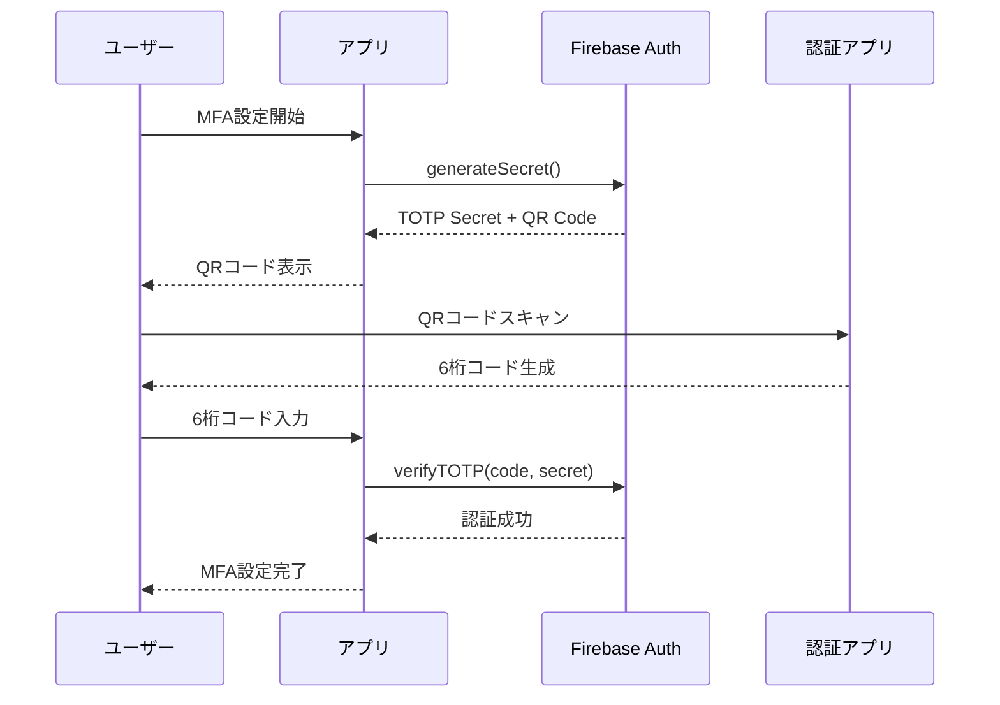
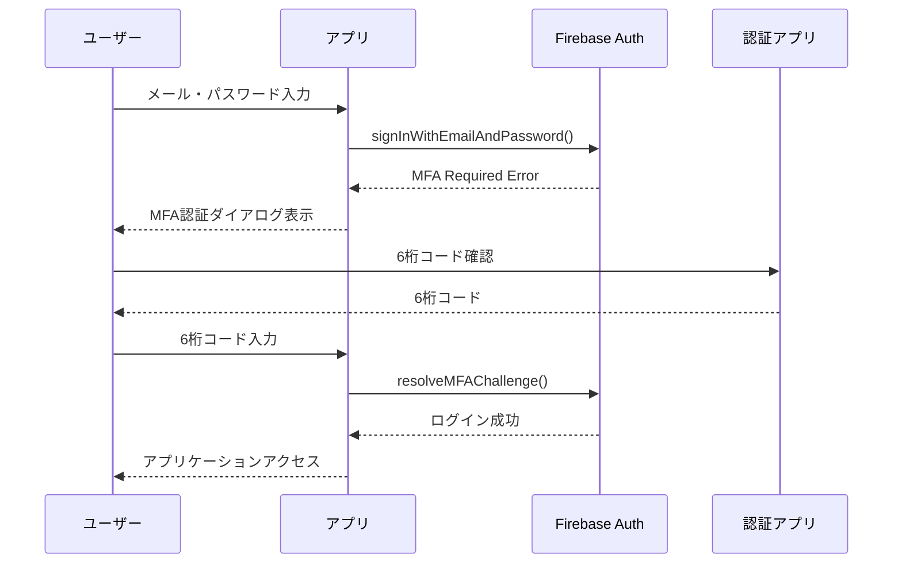

# MFA（多要素認証）機能ドキュメント

## 📋 目次
1. [MFAとは？](#mfaとは)
2. [なぜMFAが必要？](#なぜmfaが必要)
3. [実装されている機能](#実装されている機能)
4. [使用方法](#使用方法)
5. [技術仕様](#技術仕様)
6. [セキュリティ要件](#セキュリティ要件)
7. [トラブルシューティング](#トラブルシューティング)

---

## 🔐 MFAとは？

**MFA（Multi-Factor Authentication / 多要素認証）** は、ユーザーの身元を確認するために複数の認証要素を組み合わせるセキュリティ手法です。

### 認証の3要素
1. **知識要素（Something you know）**: パスワード、PIN
2. **所有要素（Something you have）**: スマートフォン、認証アプリ
3. **生体要素（Something you are）**: 指紋、顔認証

本アプリケーションでは、**知識要素（パスワード）+ 所有要素（スマートフォン）** の組み合わせでMFAを実現しています。

---

## 🛡️ なぜMFAが必要？

### セキュリティリスクの軽減
- **パスワード漏洩対策**: パスワードが漏洩しても、第2認証要素がなければログインできない
- **フィッシング攻撃対策**: 偽サイトでパスワードを盗まれても、認証アプリの情報は盗めない
- **アカウント乗っ取り防止**: 不正ログインを大幅に減少させる

### 統計データ
- MFA導入により **99.9%** のアカウント侵害を防止可能（Microsoft調査）
- パスワードのみの認証に比べて **99.9%** セキュアな認証

---

## ⚙️ 実装されている機能

### 1. TOTP認証（Time-based One-Time Password）
**認証アプリを使用した6桁のワンタイムパスワード認証**

#### 対応アプリ
- Google Authenticator
- Microsoft Authenticator
- Authy
- 1Password
- その他TOTP対応アプリ

#### 仕組み
```
1. QRコードまたはシークレットキーを認証アプリに登録
2. アプリが30秒ごとに新しい6桁コードを生成
3. ログイン時にアプリの6桁コードを入力
4. サーバーで時刻ベースの検証を実行
```

### 2. SMS認証
**携帯電話のSMSを使用した6桁のワンタイムパスワード認証**

#### 仕組み
```
1. 電話番号を登録（国際電話番号形式）
2. ログイン時に登録済み電話番号にSMS送信
3. 受信した6桁コードを入力
4. サーバーで認証コードを検証
```

#### 対応形式
- 国際電話番号形式（例：+81-90-1234-5678）
- 日本国内・海外の携帯電話番号

---

## 📱 使用方法

### 初期設定（MFA有効化）

#### ステップ1: MFA管理ページにアクセス
1. ログイン後、サイドナビゲーションから「セキュリティ設定」をクリック
2. 「多要素認証（MFA）」セクションに移動

#### ステップ2: 認証方法を選択
**TOTP認証の場合：**
1. 「追加」ボタンをクリック
2. 「認証アプリ（TOTP）」を選択
3. 「設定を開始」をクリック

**SMS認証の場合：**
1. 「追加」ボタンをクリック
2. 「SMS認証」を選択
3. 電話番号を入力（+81-90-1234-5678 形式）

#### ステップ3: 設定完了
**TOTP認証：**
1. QRコードを認証アプリでスキャン
2. 認証アプリに表示された6桁コードを入力
3. 「設定を完了」をクリック

**SMS認証：**
1. 「SMSを送信」をクリック
2. 携帯電話に届いた6桁コードを入力
3. 「設定を完了」をクリック

### ログイン時のMFA認証

#### 🚪 ログイン画面でのMFA認証手順

**ステップ1: 通常ログイン**
1. ログイン画面にアクセス
2. メールアドレスとパスワードを入力
3. 「ログイン」ボタンをクリック

**ステップ2: MFA認証ダイアログの表示**
- パスワード認証が成功すると、自動的に「多要素認証」ダイアログが表示されます
- ダイアログには「🔒 多要素認証」というタイトルが表示
- 「アカウントのセキュリティ保護のため、追加の認証が必要です」というメッセージ

**ステップ3: 認証方法の選択**

設定済みの認証方法が一覧表示されます：

📱 **認証アプリ（TOTP）の場合**
- 🔲 アイコン: QRコードアイコン
- 🔲 説明: "認証アプリからコードを取得"
- 🔲 「使用する」ボタンをクリック

📞 **SMS認証の場合**
- 🔲 アイコン: SMSアイコン  
- 🔲 説明: "登録済みの電話番号に認証コードを送信"
- 🔲 「使用する」ボタンをクリック

**ステップ4: 認証コードの入力**

📱 **認証アプリ（TOTP）を選択した場合:**
1. Google Authenticator等の認証アプリを開く
2. 登録済みアカウントの6桁コードを確認
3. ダイアログの「認証コード」フィールドに入力
4. コードは中央揃え・大きな文字で表示される
5. 6桁入力すると「認証する」ボタンが有効になる

📞 **SMS認証を選択した場合:**
1. 登録済み電話番号にSMSが自動送信される
2. 携帯電話でSMSを確認
3. 届いた6桁コードをダイアログに入力
4. 6桁入力すると「認証する」ボタンが有効になる

**ステップ5: 認証の完了**
1. 「認証する」ボタン（✓アイコン付き）をクリック
2. 認証が成功するとダイアログが閉じる
3. アプリケーションのメイン画面に自動遷移

#### 🔄 認証方法の切り替え

- 認証コード入力画面で「別の認証方法を選択」リンクをクリック
- 認証方法選択画面に戻る
- 別の設定済み方法を選択可能

#### ⚠️ エラー時の対応

**認証コードが正しくない場合:**
- 赤いエラーメッセージが表示
- 最新のコードで再入力
- 時刻同期を確認（TOTP）

**SMSが届かない場合:**
- 「別の認証方法を選択」で認証アプリに切り替え
- 電話番号設定を確認

#### 💡 ログイン画面の特徴

**UIデザイン:**
- レスポンシブ対応（モバイル・タブレット・PC）
- モバイルでは全画面表示
- 直感的なアイコンと説明文

**操作性:**
- 認証コードは数字のみ入力可能
- 6桁入力で自動的にボタンが有効化
- ESCキーでのキャンセル無効（セキュリティ）

**セキュリティ:**
- MFAダイアログ表示中はログイン処理が保留
- キャンセル時は完全にログイン処理が中断
- 認証成功まではアプリアクセス不可

#### 🖥️ ログイン画面のUI構成

**メインログインフォーム:**
- メールアドレス入力フィールド（📧アイコン付き）
- パスワード入力フィールド（🔒アイコン付き、表示/非表示切り替え可能）
- 「ログイン状態を保持」チェックボックス
- 青い「ログイン」ボタン
- Googleログイン・パスキーログイン（利用可能な場合）

**MFA認証ダイアログ（自動表示）:**
- タイトル: 「🔒 多要素認証」
- 説明文: セキュリティ保護の案内
- 認証方法選択リスト（カード形式）
- 認証コード入力フィールド（6桁・中央揃え）
- 「認証する」「キャンセル」ボタン

#### 🔄 複数認証方法の使い分け

**認証方法選択画面:**
- 設定済みのすべての認証方法を表示
- 各方法にアイコンと説明を表示
- クリックで即座に選択・次の画面に進む

**認証方法の切り替え:**
- 認証コード入力画面から戻ることが可能
- 「別の認証方法を選択」リンクをクリック
- 他の設定済み方法をいつでも選択可能

**推奨される使い分け:**
- 📱 **普段使い**: 認証アプリ（TOTP）- オフラインでも利用可能
- 📞 **バックアップ**: SMS認証 - 認証アプリが使えない時

### MFA設定の管理

#### 設定済み認証方法の確認
- MFA管理ページで全ての設定済み方法を表示
- 各方法の登録日時を確認可能
- 認証方法の種類とステータスを表示

#### 認証方法の追加
- 最大5個まで認証方法を設定可能
- TOTP・SMS を組み合わせて設定可能
- バックアップ用の複数設定を推奨

#### 認証方法の削除
1. 削除したい認証方法の「削除」ボタンをクリック
2. 確認ダイアログで削除を確定
3. 即座に削除され、次回ログインから使用不可

---

## 🔧 技術仕様

### アーキテクチャ

#### フロントエンド
```typescript
src/auth/
├── hooks/useMFA.ts              # MFA機能のビジネスロジック
├── components/
│   ├── MFASetupDialog.tsx       # MFA設定ダイアログ
│   ├── MFAVerificationDialog.tsx # MFA認証ダイアログ
│   └── MFAManagement.tsx        # MFA管理ページ
├── stores/useAuthStore.ts       # MFA状態管理
└── types.ts                     # TypeScript型定義
```

#### バックエンド
- **Firebase Authentication**: Google提供のMFA機能を使用
- **Firebase Functions**: SMS送信・検証ロジック
- **reCAPTCHA**: SMS送信時のボット対策

### データフロー

#### MFA設定時


#### ログイン時MFA認証


### API仕様

#### MFA設定 API
```typescript
interface MFASetupAPI {
  // TOTP設定
  setupTOTP(): Promise<TotpSecret>;
  verifyTOTP(code: string, secret: TotpSecret): Promise<boolean>;
  
  // SMS設定
  setupSMS(phoneNumber: string): Promise<boolean>;
  verifySMS(code: string): Promise<boolean>;
  
  // MFA削除
  deleteMFA(factorUid: string): Promise<boolean>;
}
```

#### MFA認証 API
```typescript
interface MFAAuthAPI {
  // ログイン時MFA解決
  resolveMFAChallenge(
    resolver: MultiFactorResolver,
    code: string,
    method: 'totp' | 'sms'
  ): Promise<boolean>;
  
  // MFA状態確認
  getMFAStatus(): Promise<MultiFactorInfo[]>;
}
```

---

## 🔒 セキュリティ要件

### 暗号化・セキュリティ
- **TOTP**: RFC 6238準拠のTime-based One-Time Password
- **SMS**: Firebase Authentication経由の暗号化SMS
- **reCAPTCHA**: v3使用でボット対策
- **セッション**: MFA認証後の安全なセッション管理

### Firebase Authenticationセキュリティ
- **SOC 2 Type II認証**: Google Cloudの最高レベルセキュリティ
- **ISO 27001認証**: 国際的な情報セキュリティ管理基準
- **暗号化**: すべてのデータがTLS 1.2以上で暗号化
- **監査ログ**: すべての認証イベントがログ記録

### アプリケーションレベルセキュリティ
- **レート制限**: 認証試行回数の制限
- **タイムアウト**: 認証コードの有効期限（30秒〜5分）
- **ブルートフォース対策**: 連続認証失敗時のアカウントロック
- **セッション管理**: 適切なセッション期限・更新

---

## 🚀 運用ガイド

### ユーザー向けベストプラクティス

#### 推奨設定
1. **複数認証方法**: TOTP + SMS の両方を設定
2. **バックアップコード**: 認証アプリのバックアップを保存
3. **定期確認**: 月1回は認証方法が正常に動作するか確認

#### セキュリティ注意事項
- **QRコードの取り扱い**: 他人に見せない・スクリーンショットは削除
- **認証アプリ**: 信頼できるアプリのみ使用
- **電話番号**: 最新の番号を登録・変更時は更新

### 管理者向け運用

#### 監視項目
- MFA設定率の監視
- 認証失敗率の監視
- SMS送信コストの監視
- セキュリティインシデントの追跡

#### サポート対応
- **MFA無効化**: 緊急時の管理者権限での無効化手順
- **アカウント復旧**: 端末紛失時の復旧プロセス
- **トラブルシューティング**: よくある問題と解決方法

---

## 🔧 トラブルシューティング

### よくある問題と解決方法

#### 認証コードが正しくない
**原因:**
- 時刻同期のずれ
- 古いコードの使用
- 入力ミス

**解決方法:**
1. スマートフォンの時刻設定を確認
2. 最新のコードを使用
3. 認証アプリの再同期
4. 別の認証方法を試行

#### SMS認証コードが届かない
**原因:**
- 電話番号の間違い
- SMS受信拒否設定
- 海外からのアクセス制限

**解決方法:**
1. 電話番号を再確認（国際電話番号形式）
2. SMS受信設定を確認
3. 認証アプリ（TOTP）への切り替え

#### 認証アプリを失くした場合
**対処手順:**
1. 別の認証方法（SMS）でログイン
2. MFA管理ページで古い設定を削除
3. 新しい端末で認証アプリを再設定
4. バックアップコードがある場合は利用

#### アカウントがロックされた場合
**対処手順:**
1. 30分待ってから再試行
2. パスワードリセットを実行
3. サポートに連絡（緊急時）

### エラーメッセージ一覧

| エラーメッセージ | 原因 | 解決方法 |
|----------------|------|----------|
| `認証コードが正しくありません` | コードの入力ミス・期限切れ | 最新コードで再試行 |
| `電話番号の形式が正しくありません` | 国際電話番号形式ではない | +81-90-1234-5678 形式で入力 |
| `認証コードの有効期限が切れています` | 古いコードを使用 | 新しいコードを生成・入力 |
| `リクエストが多すぎます` | 連続認証失敗 | 30分待ってから再試行 |
| `MFA設定可能数の上限に達しています` | 5個以上設定しようとした | 不要な設定を削除してから追加 |

### サポート連絡先
- **技術サポート**: support@workapp.com
- **緊急時**: emergency@workapp.com（アカウントロック等）
- **FAQ**: https://workapp.com/mfa-faq

---

## 📚 参考資料

### 技術文書
- [Firebase Authentication MFA](https://firebase.google.com/docs/auth/web/multi-factor)
- [RFC 6238 TOTP仕様](https://tools.ietf.org/html/rfc6238)
- [MUI コンポーネント](https://mui.com/material-ui/)

### セキュリティガイドライン
- [NIST SP 800-63B](https://pages.nist.gov/800-63-3/sp800-63b.html)
- [OWASP Authentication Cheat Sheet](https://cheatsheetseries.owasp.org/cheatsheets/Authentication_Cheat_Sheet.html)

### 認証アプリダウンロード
- [Google Authenticator (iOS)](https://apps.apple.com/app/google-authenticator/id388497605)
- [Google Authenticator (Android)](https://play.google.com/store/apps/details?id=com.google.android.apps.authenticator2)
- [Microsoft Authenticator (iOS)](https://apps.apple.com/app/microsoft-authenticator/id983156458)
- [Microsoft Authenticator (Android)](https://play.google.com/store/apps/details?id=com.azure.authenticator)

---

**最終更新**: 2025年7月2日  
**バージョン**: 1.0.0  
**作成者**: WorkApp Development Team
